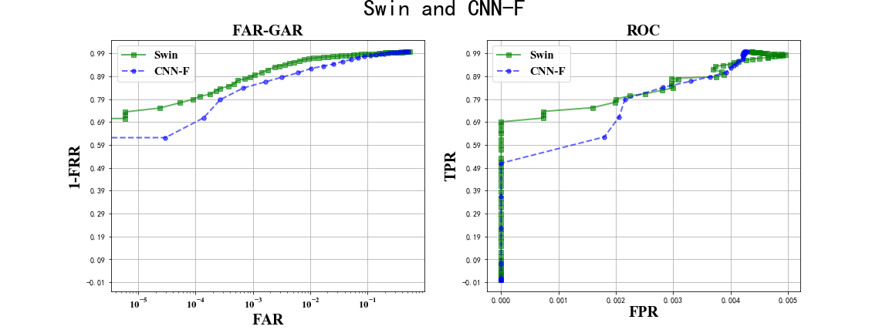

# Palmprint-recognitition Lightly Neural Network Baseline
Paper: "Bag of Tricks and A Strong Baseline for Deep Person Re-identification"[[pdf]](https://arxiv.org/abs/1903.07071)

We plan to release those lightly backbones for Palmprint-recognition on this baseline[[link]](https://github.com/michuanhaohao/reid-strong-baseline). You can use this project on your edge GPU device.
Otherwise, we provide new backbone like transformer, we actually select small model.

|model|method|ERR|mAP|
|---- |----  |----|----|
|resnet34| | | |
|repVGG-A0| | | |
|GhostNetv2| | | |
|ShuffleNetv2| | | |
|MobileNetv3| | | |
|PyramidTNT-Ti| | | |
|G-Ghost RegNet| | | |
|SqueezeNet| | | |
|Swin-T| | | |

```
@inproceedings{luo2019bag,
  title={Bag of Tricks and A Strong Baseline for Deep Person Re-identification},
  author={Luo, Hao and Gu, Youzhi and Liao, Xingyu and Lai, Shenqi and Jiang, Wei},
  booktitle={Proceedings of the IEEE Conference on Computer Vision and Pattern Recognition Workshops},
  year={2019}
}
```

## Directory layout

    .
    ├── config                  # hyperparameters settings
    │   └── ...                 
    ├── datasets                # data loader
    │   └── ...           
    ├── log                     # log and model weights             
    ├── loss                    # loss function code
    │   └── ...   
    ├── model                   # model
    │   └── ...  
    ├── processor               # training and testing procedures
    │   └── ...    
    ├── solver                  # optimization code
    │   └── ...   
    ├── tools                   # tools
    │   └── ...
    ├── utils                   # metrics code
    │   └── ...
    ├── train.py                # train code 
    ├── test.py                 # test code 
    ├── get_vis_result.py       # get visualized results 
    ├── docs                    # docs for readme              
    └── README.md


## Pipeline

<div align=center>

</div>

## Pretrained Model

## Get Started
1. `cd` to folder where you want to download this repo

2. Run `git clone https://github.com/zzk2021/Palmprint-recognition-Lightly-Neural-Network-Baseline.git`

3. Install dependencies:
    - [pytorch>=0.4](https://pytorch.org/)
    - torchvision
    - cv2 (for preprocess)

## Train

```bash
python train.py
```

## Test

```bash
python test.py
```

To get visualized reID results, first create `results` folder in log dir, then:
```bash
python ./tools/get_vis_result.py

```

You will get the FAR-GAR and ROC curve, like:
<div align=center>

</div>

## Results